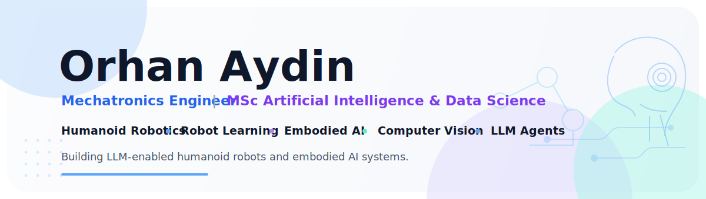
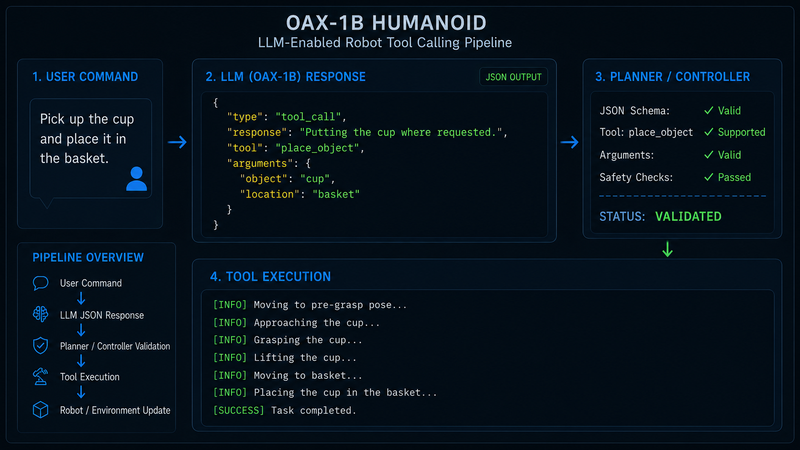
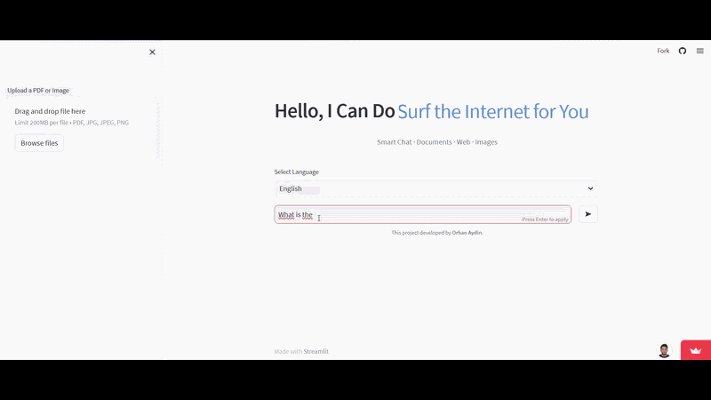
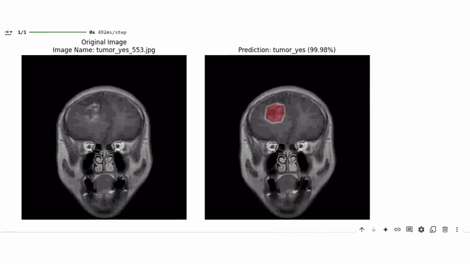
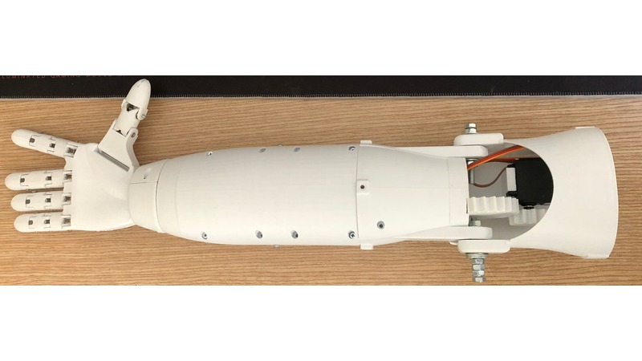
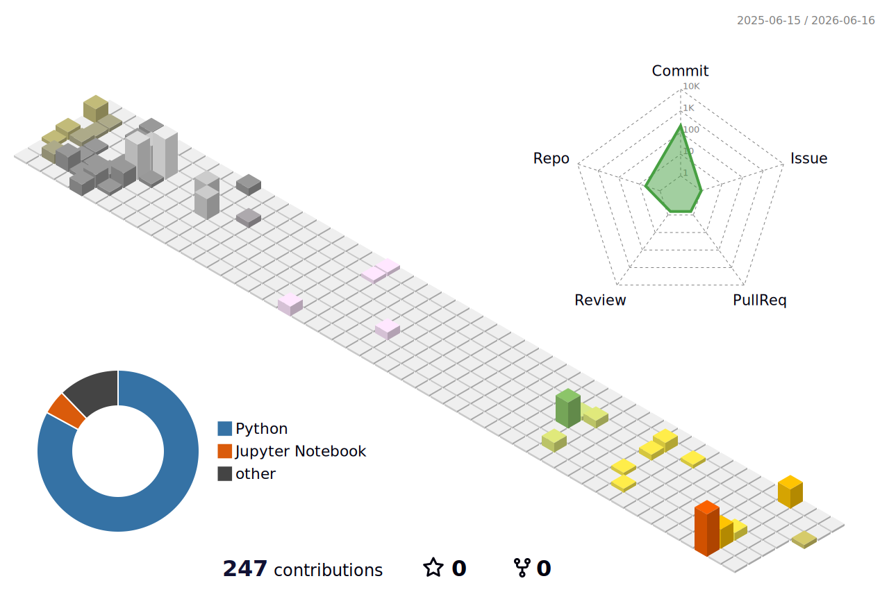

  

### Mechatronics Engineer | MSc Data Science & Artificial Intelligence

Building intelligent robotic systems across **mechanics, perception, control and AI**.

  
  
  

---

## Featured Projects

<table>
<tr>
<td width="50%" valign="top">

### [LLM-Enabled Humanoid Robot](https://github.com/orhanaydinn/oax_humanoid_robot)

  

Custom fixed-base humanoid robot integrating mechanical design, embedded control, computer vision, inverse kinematics and LLM-based task execution.

`Python` `OpenCV` `Arduino` `LLM` `IK/FK` `3D Printing`

[Case Study](https://orhanaydinn.github.io/projects/humanoid/) · [GitHub](https://github.com/orhanaydinn/oax_humanoid_robot)

</td>
<td width="50%" valign="top">

### [OAX-1B: Custom LLM for Robot Tool Calling](https://huggingface.co/orhanaydinn/OAX-1B-Humanoid)

  

A custom 1B-parameter LLaMA-style language model pre-trained from scratch and fine-tuned for structured JSON robot tool calling, clarification and safe action generation.

`PyTorch` `Transformers` `LoRA` `SFT` `LLM`

[Case Study](https://orhanaydinn.github.io/projects/oax-1b/) · [Hugging Face](https://huggingface.co/orhanaydinn/OAX-1B-Humanoid)

</td>
</tr>

<tr>
<td width="50%" valign="top">

### [AI-Powered Conversational Assistant](https://github.com/orhanaydinn/qa_assistant)

  

Multimodal RAG system supporting semantic search, OCR and question answering from PDFs, images and web sources through an interactive Streamlit interface.

`Python` `Streamlit` `FAISS` `LangChain` `OCR`

[Case Study](https://orhanaydinn.github.io/projects/rag-assistant/) · [GitHub](https://github.com/orhanaydinn/qa_assistant)

</td>
<td width="50%" valign="top">

### [Brain Tumor & Alzheimer Classification](https://github.com/orhanaydinn/brainTumor_Alzheimer_Prediction)

  

Deep-learning pipeline for MRI-based brain-tumor and Alzheimer classification, transfer learning and visual analysis of annotated medical images.

`Python` `TensorFlow` `OpenCV` `CNN` `Transfer Learning`

[Case Study](https://orhanaydinn.github.io/projects/brain-mri/) · [GitHub](https://github.com/orhanaydinn/brainTumor_Alzheimer_Prediction)

</td>
</tr>

<tr>
<td width="50%" valign="top">

### [SCARA Robot Design, Manufacturing & Control](https://github.com/orhanaydinn/scara-robot-design-and-control)

  

BSc dissertation project covering the full development of a custom SCARA robot from CAD and 3D printing to Arduino-based control and a Processing interface.

`SolidWorks` `Arduino` `CNC Shield` `Processing` `3D Printing`

[Case Study](https://orhanaydinn.github.io/projects/scara/) · [GitHub](https://github.com/orhanaydinn/scara-robot-design-and-control)

</td>
<td width="50%" valign="top">

### [Bionic Hand Prototype](https://github.com/orhanaydinn/bionic-hand-prototype)

  

Custom bionic-hand prototype with servo-based actuation, Arduino control and a homemade flex-sensor input concept using conductive wire and anti-static material.

`Arduino` `ESP32` `Flex Sensors` `Servo Control` `3D Printing`

[Case Study](https://orhanaydinn.github.io/projects/bionic-hand/) · [GitHub](https://github.com/orhanaydinn/bionic-hand-prototype)

</td>
</tr>
</table>

---

## GitHub Activity

Development activity and language usage overview

  
  

---

## Technical Stack

<table>
<tr>
<td width="20%" valign="top">

### Robotics & Simulation

MuJoCo  
Robot Manipulation  
Behaviour Cloning  
Reinforcement Learning  
IK / FK  
Motion Planning

</td>
<td width="20%" valign="top">

### AI & Computer Vision

PyTorch  
TensorFlow  
OpenCV  
YOLO  
Transformers  
Hugging Face  
PEFT / LoRA

</td>
<td width="20%" valign="top">

### Embedded Systems

Arduino  
STM32  
ESP32  
Raspberry Pi  
Motor Control  
Sensor Integration  
Serial Communication

</td>
<td width="20%" valign="top">

### Mechanical Design

SolidWorks  
AutoCAD  
Siemens NX  
3D Printing  
Prototyping  
Design for Manufacture

</td>
<td width="20%" valign="top">

### Programming & Tools

Python  
C++  
SQL  
Git  
Docker  
Linux  
Streamlit

</td>
</tr>
</table>

---

## Let's Connect

<table width="100%">
<tr>
<td width="33.33%" align="center" valign="middle">

### Portfolio
[orhanaydinn.github.io](https://orhanaydinn.github.io)

</td>
<td width="33.33%" align="center" valign="middle">

### LinkedIn
[linkedin.com/in/orhan-aydin](https://www.linkedin.com/in/orhan-aydin/)

</td>
<td width="33.33%" align="center" valign="middle">

### Email
[orhanaydinmechatronic@gmail.com](mailto:orhanaydinmechatronic@gmail.com)

</td>
</tr>
</table>

 

Thanks for visiting.

