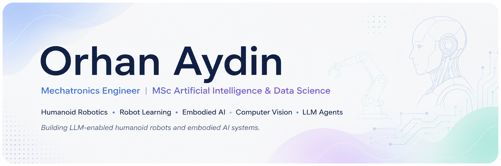
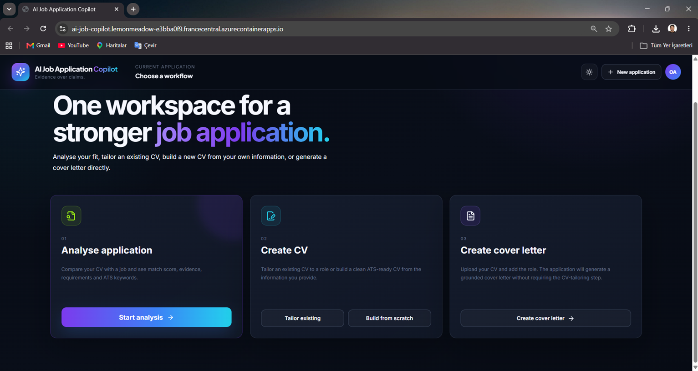
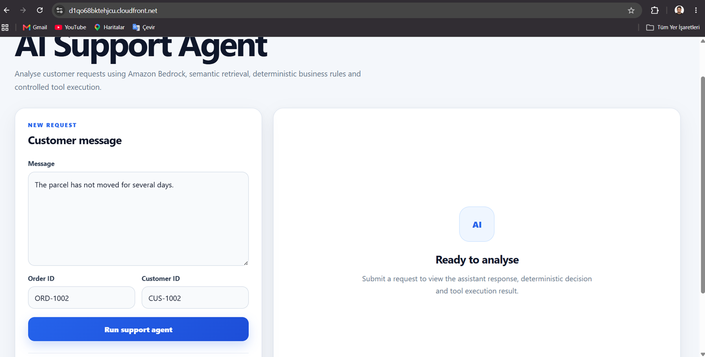
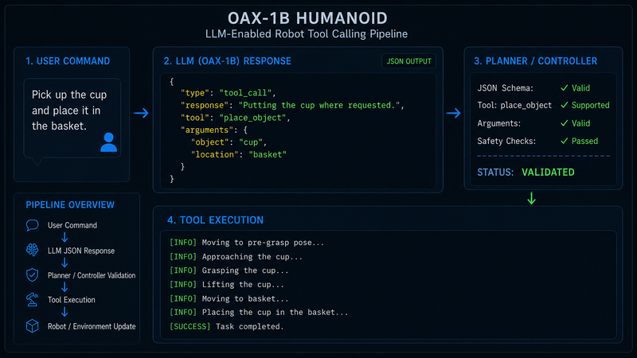
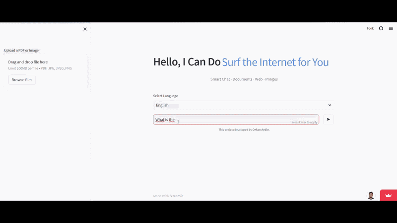
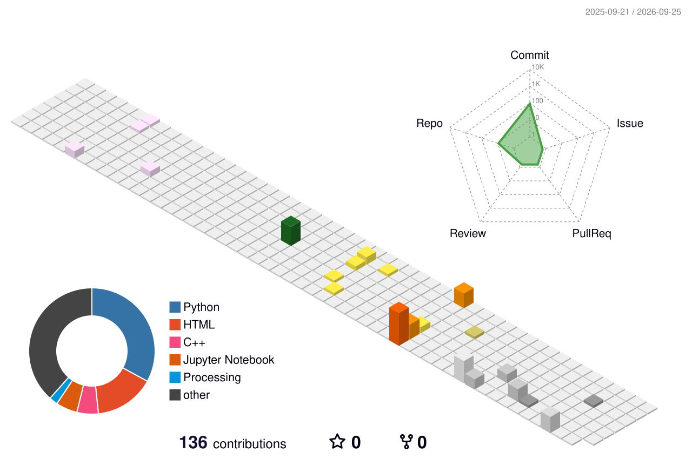

  

## About Me

I build end-to-end AI applications and intelligent robotic systems, combining **full-stack development, language-model training, computer vision and validated tool execution**. My projects span cloud-deployed applications on AWS and Azure, a language model trained from scratch, and a physical humanoid robot.

<strong>Applied AI · Language Models · Embodied AI · Robotics</strong>

  
  
  
  

<h2 align="center">Education</h2>

<table width="100%">
<tr>
<td width="50%" align="center" valign="top">
<h3>🎓 Bournemouth University</h3>

<strong>MSc Data Science &amp; Artificial Intelligence</strong>

<strong>Distinction · 75.56%</strong>

United Kingdom · 2025–2026

</td>
<td width="50%" align="center" valign="top">
<h3>⚙️ Erciyes University</h3>

<strong>BSc Mechatronics Engineering</strong>

Mechanical Design · Electronics · Control

Turkey · 2016–2022

</td>
</tr>
</table>

<h2 align="center">Featured Projects</h2>

<table>
<tr>
<td width="50%" valign="top">

### [LLM-Enabled Humanoid Robot](https://orhanaydinn.github.io/projects/humanoid/)

An MSc thesis system powered by OAX, a language model I pre-trained from scratch and fine-tuned for structured tool calling. Integrates visual perception, system state and Planner–Controller validation with a custom physical humanoid robot.

Python · PyTorch · OpenCV · Tool Calling · Embedded Control

[Case Study](https://orhanaydinn.github.io/projects/humanoid/) · [GitHub](https://github.com/orhanaydinn/oax_humanoid_robot)

</td>
<td width="50%" valign="top">

### [AI Job Application Copilot](https://orhanaydinn.github.io/projects/ai-job-application-copilot/)

Full-stack AI application for CV-to-job analysis, evidence-backed matches, tailored CVs and cover letters, editable previews and DOCX export. Deployed on Azure.

React · TypeScript · FastAPI · Azure OpenAI · Docker

[Case Study](https://orhanaydinn.github.io/projects/ai-job-application-copilot/) · [GitHub](https://github.com/orhanaydinn/ai-job-application-copilot) · [Live Demo](https://ai-job-copilot.lemonmeadow-e3bba0f9.francecentral.azurecontainerapps.io/)

</td>
</tr>
<tr>
<td width="50%" valign="top">

### [Enterprise AI Support Agent](https://orhanaydinn.github.io/projects/enterprise-ai-support-agent/)

A cloud-deployed support agent combining policy retrieval, deterministic business rules, controlled tool routing and execution traces on AWS.

Amazon Bedrock · RAG · FastAPI · AWS Lambda · DynamoDB

[Case Study](https://orhanaydinn.github.io/projects/enterprise-ai-support-agent/) · [GitHub](https://github.com/orhanaydinn/enterprise-ai-support-agent) · [Live Demo](https://d1qo68bktehjcu.cloudfront.net)

</td>
<td width="50%" valign="top">

### [OAX — Language Model Trained from Scratch](https://orhanaydinn.github.io/projects/oax-1b/)

A custom LLaMA-style language model pre-trained from scratch and fine-tuned with LoRA for structured JSON tool calls, clarification and humanoid interaction.

PyTorch · Transformers · LoRA · SFT · Tool Calling

[Case Study](https://orhanaydinn.github.io/projects/oax-1b/) · [Hugging Face](https://huggingface.co/orhanaydinn/OAX-1B-Humanoid)

</td>
</tr>
<tr>
<td width="50%" valign="top">

### [AI-Powered Multimodal RAG Assistant](https://orhanaydinn.github.io/projects/rag-assistant/)

Modular RAG application supporting semantic retrieval, OCR and question answering from PDFs, images and web sources through a Streamlit interface.

Python · Streamlit · FAISS · Transformers · OCR

[Case Study](https://orhanaydinn.github.io/projects/rag-assistant/) · [GitHub](https://github.com/orhanaydinn/qa_assistant)

</td>
<td width="50%" valign="top">

### [SCARA Robot Design, Manufacturing & Control](https://orhanaydinn.github.io/projects/scara/)

BSc dissertation covering a custom SCARA robot from CAD and 3D printing to Arduino-based control and a Processing interface.

SolidWorks · Arduino · CNC Shield · Processing · 3D Printing

[Case Study](https://orhanaydinn.github.io/projects/scara/) · [GitHub](https://github.com/orhanaydinn/scara-robot-design-and-control)

</td>
</tr>
</table>

<h2 align="center">Technical Focus</h2>

<table width="100%">
<tr>
<th width="25%">Applied AI &amp; Full-Stack</th>
<th width="25%">LLMs, RAG &amp; Agents</th>
<th width="25%">Robotics &amp; Intelligent Systems</th>
<th width="25%">Mechanical Design &amp; Robot Learning</th>
</tr>
<tr>
<td valign="top" align="center">Python FastAPI · Pydantic React · TypeScript REST APIs Docker AWS · Azure</td>
<td valign="top" align="center">PyTorch · Transformers Hugging Face Pre-training · LoRA / PEFT FAISS · RAG Structured Tool Calling Evaluation</td>
<td valign="top" align="center">OpenCV · YOLO Embedded Control Sensor Integration Arduino STM32 · ESP32 Hardware–Software Integration</td>
<td valign="top" align="center">SolidWorks · AutoCAD · NX 3D Printing MuJoCo Behaviour Cloning Reinforcement Learning IK / FK</td>
</tr>
</table>

<h2 align="center">GitHub Activity</h2>

  <a href="https://github.com/orhanaydinn?tab=overview">Contribution History</a>
  &nbsp;·&nbsp;
  <a href="https://github.com/orhanaydinn?tab=repositories">Repositories</a>

  

<h2 align="center">Let's Connect</h2>

<table width="100%">
<tr>
<th width="33%">Portfolio</th>
<th width="33%">LinkedIn</th>
<th width="34%">Email</th>
</tr>
<tr>
<td align="center"><a href="https://orhanaydinn.github.io/">Explore my portfolio</a></td>
<td align="center"><a href="https://www.linkedin.com/in/orhan-aydin/">Connect professionally</a></td>
<td align="center"><a href="mailto:orhanaydinmechatronic@gmail.com">Email me</a></td>
</tr>
</table>

